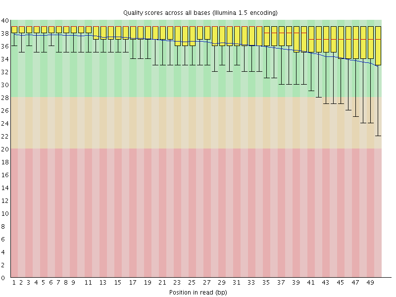
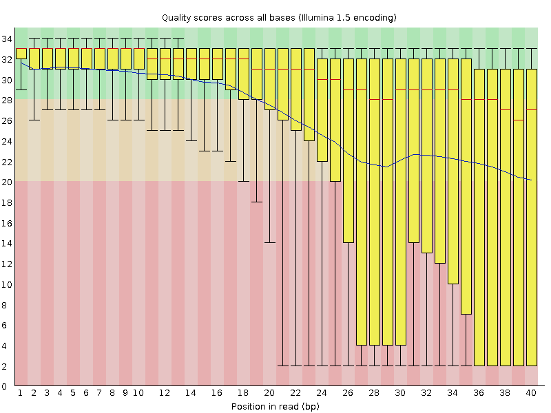
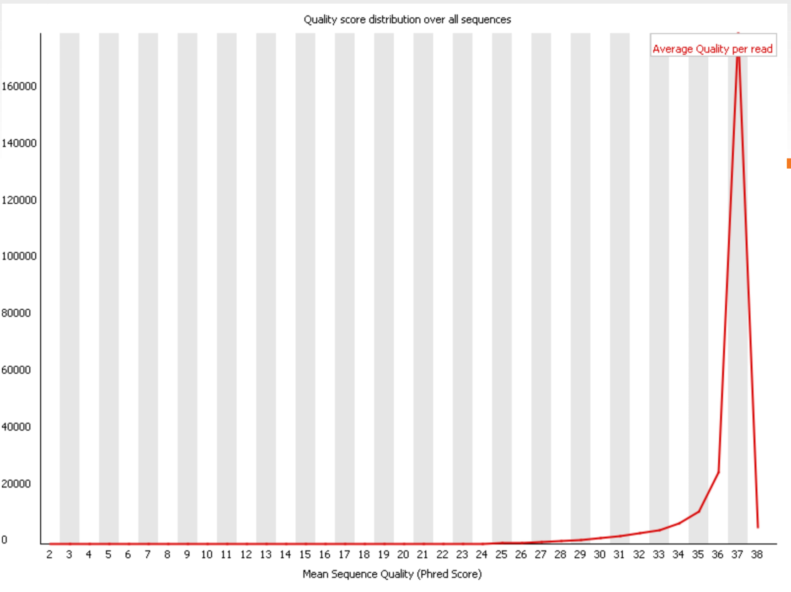
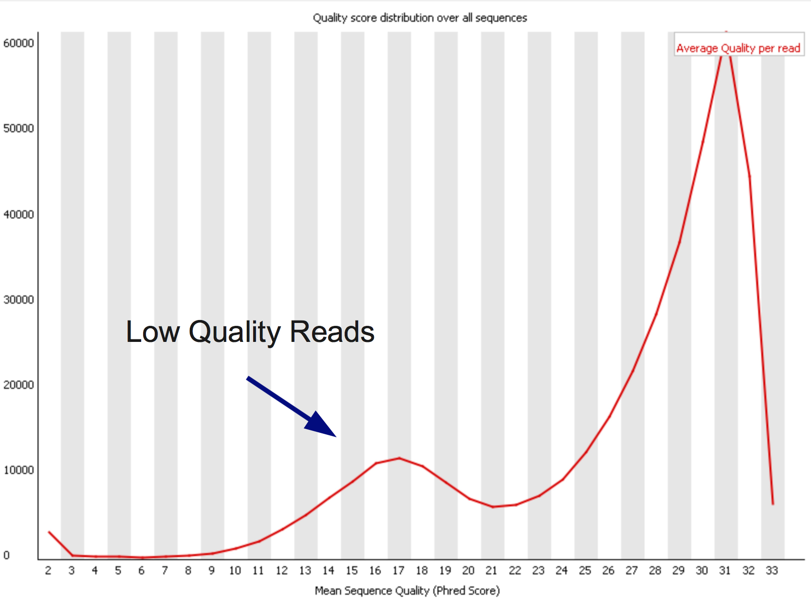
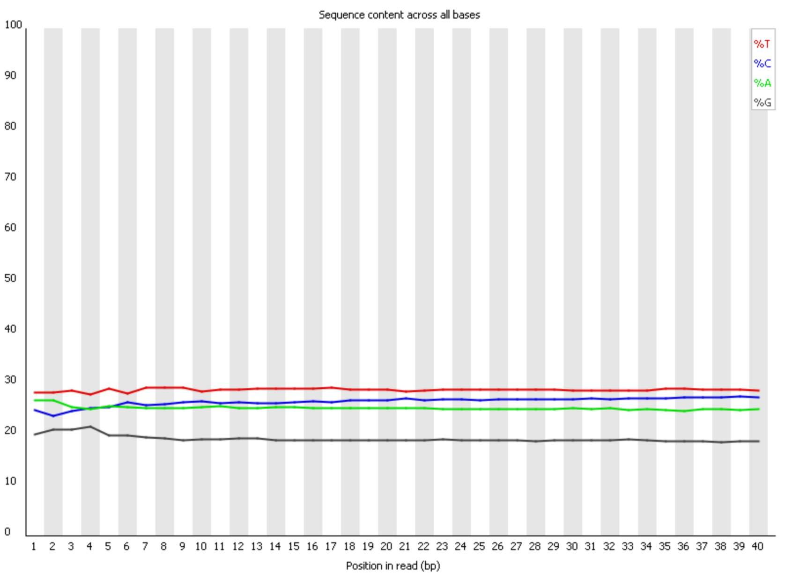
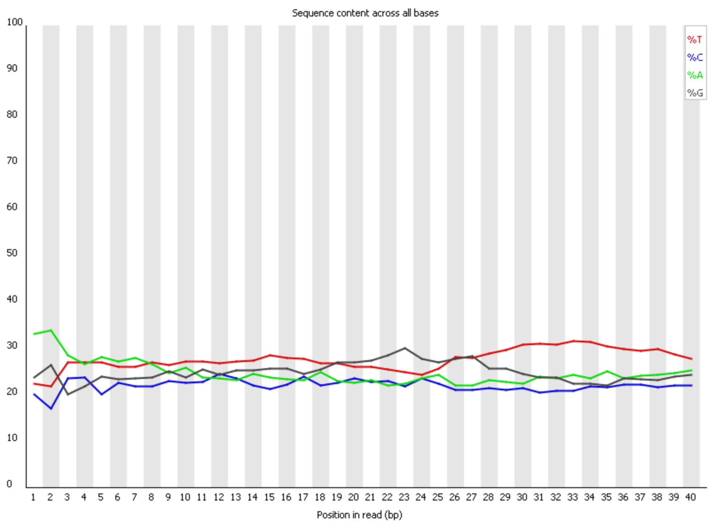
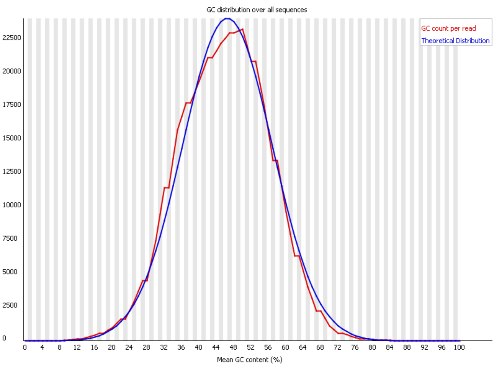
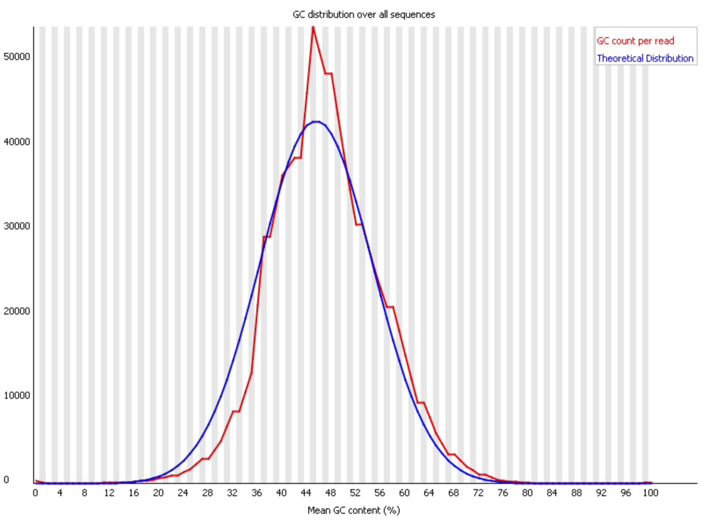

## Intro

在WGS数据的分析过程中，FASTQ 是我们存储核苷酸序列信息（就是DNA序列）或者蛋白质序列信息常使用的文本文件，虽然看起来名字有些古怪，但它们完全是纯文本文件。此外，FASTQC 是一种常见的工具用来处理 FASTQ 的数据。

## FASTQ

FASTQ存的则是产生自测序仪的原始测序数据，它由测序的图像数据转换过来，也是文本文件。文件后缀通常都是.fastq，.fq或者.fq.gz（gz压缩），以下是它的一个例子：

```text
@DJB775P1:248:D0MDGACXX:7:1202:12362:49613
TGCTTACTCTGCGTTGATACCACTGCTTAGATCGGAAGAGCACACGTCTGAA
+
JJJJJIIJJJJJJHIHHHGHFFFFFFCEEEEEDBD?DDDDDDBDDDABDDCA
@DJB775P1:248:D0MDGACXX:7:1202:12782:49716
CTCTGCGTTGATACCACTGCTTACTCTGCGTTGATACCACTGCTTAGATCGG
+
IIIIIIIIIIIIIIIHHHHHHFFFFFFEECCCCBCECCCCCCCCCCCCCCCC
```

每个FASTQ文件包含四行数据（成为一个 `read`），第一行以@开头，第二行是DNA序列，第三行以+开头（在旧版的FASTQ文件中会直接重复第一行的信息，但现在一般什么也不加），第四行是质量值（它描述的是每个测序碱基的可靠程度）。质量值是用ASCII码表示的，通常是用Phred质量分数来表示的。

Phred quality score ($Q$)：

$$
Q = -10 * log_{10} (P)
$$

比如，如果该碱基的测序错误率是0.01，那么质量值就是20（俗称Q20），如果是0.001，那么质量值就是30（俗称Q30）。Q20和Q30的比例常常被我们用来评价某次测序结果的好坏，比例越高就越好。下表更进一步解释了质量值高低的含义：

| Phred Quality Score | Probability of incorrect base call | Base call accuracy |
| ------------------- | ---------------------------------- | ------------------ |
| 10                  | 1 in 10                            | 90%                |
| 20                  | 1 in 100                           | 99%                |
| 30                  | 1 in 1000                          | 99.9%              |
| 40                  | 1 in 10,000                        | 99.99%             |
| 50                  | 1 in 100,000                       | 99.999%            |
| 60                  | 1 in 1,000,000                     | 99.9999%           |

现在最常见的ASCII编码是Sanger格式（Phred+33），它的ASCII码范围是33-126，下限是33，也就是直接在质量值上+33。质量值范围是0-93。

## FASTQC

FASTQC是一个用于评估测序数据质量的工具，它可以生成一份报告，帮助我们了解测序数据的质量。它会检查以下几个方面：

<div style="display: flex; justify-content: space-between; margin: 20px 0;">
  <div style="width: 48%; text-align: center;">
    <h4 style="margin-bottom: 10px;">Good Quality</h4>
    
  </div>
  <div style="width: 48%; text-align: center;">
    <h4 style="margin-bottom: 10px;">Bad Quality</h4>
    
  </div>
</div>

这里可以看出，通常测序碱基数越多，quality越差。有时如果你测了250bp的，但是因为质量太差，可能只能取前200bp。

_note：illumina双端测序通常是150bp_

---

<div style="display: flex; justify-content: space-between; margin: 20px 0;">
  <div style="width: 48%; text-align: center;">
    <h4 style="margin-bottom: 10px;">Good Quality</h4>
    
  </div>
  <div style="width: 48%; text-align: center;">
    <h4 style="margin-bottom: 10px;">Bad Quality</h4>
    
  </div>
</div>

根据中位数可视化quality。

---

<div style="display: flex; justify-content: space-between; margin: 20px 0;">
  <div style="width: 48%; text-align: center;">
    <h4 style="margin-bottom: 10px;">Good Quality</h4>
    
  </div>
  <div style="width: 48%; text-align: center;">
    <h4 style="margin-bottom: 10px;">Bad Quality</h4>
    
  </div>
</div>

利用碱基分布来可视化的quality。前者其实是质量较好的，因为再后面四种碱基都分布平滑，要注意的是可能需要去除前面的几个碱基。也许是在测序开始的时候出了点问题。

---

<div style="display: flex; justify-content: space-between; margin: 20px 0;">
  <div style="width: 48%; text-align: center;">
    <h4 style="margin-bottom: 10px;">Good Quality</h4>
    
  </div>
  <div style="width: 48%; text-align: center;">
    <h4 style="margin-bottom: 10px;">Bad Quality</h4>
    
  </div>
</div>

根据GC含量可视化的quality。

---

高质量的read:

1. 稳定
2. read中持续的高质量片段
3. 沿长度方向平滑
