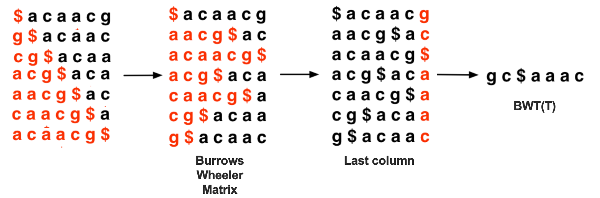
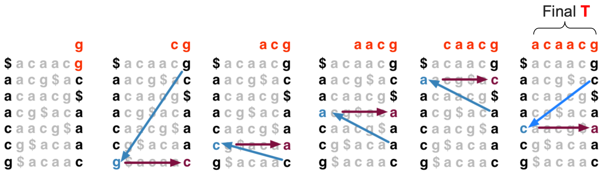
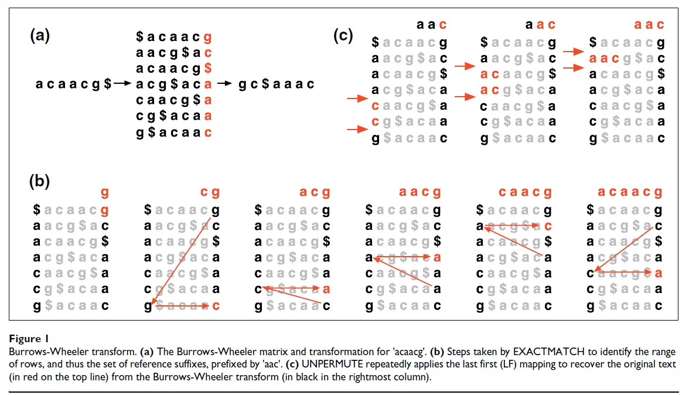
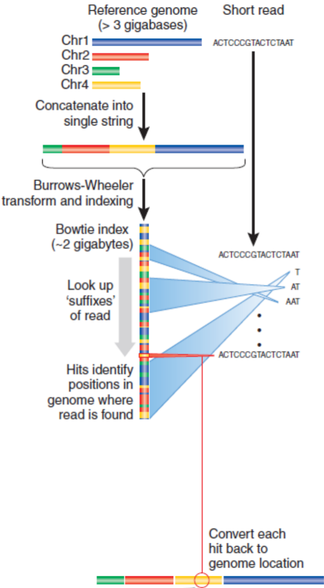

## Seed

Seed算法将数据库序列分解为k-mer词（序列中长度为k的连续子序列）并hash其位置以加快后续搜索，使用哈希表来储存存储参考序列中所有可能的种子位置。在NCBI的blast中，就使用了类似seed的算法（seed-and-extend paradigm）来快速查找相关序列。

BLAST Algorithm：对于每个k-mer，BLAST会在数据库中查找所有匹配的k-mer，并将其位置存储在哈希表中。接下来，BLAST会扩展这些匹配的k-mer，以找到更长的匹配序列。这个过程称为“扩展”，它使用动态规划算法来计算匹配序列的得分，并根据得分来确定最佳匹配。保留统计学意义上的显著性匹配序列HSP (High-scoring Segment Pairs)。使用Smith-Waterman算法来将HSPs连接并获取最佳对齐。
但是对于现在来说并不常用。

## Suffix Array

它包含了一个字符串所有后缀的起始位置的有序列表。这个列表是按照后缀字符串的字典序进行排序的，使得后缀数组可以用于快速地进行字符串匹配、序列比对和其他相关操作。简单来说，后缀数组是一个高效索引，用于快速查找和比较生物序列中的子字符串。

建立suffix的时间复杂度是O(n)，n是基因组长度。搜索复杂度是O(mlogn)，一般使用二分法查找，m是查询长度。

已经有一些软件使用suffix array 进行mapping，在RNAseq中有非常广泛的利用，比如 [STAR](https://academic.oup.com/bioinformatics/article/29/1/15/272537)。

问题是创建基因组序列的后缀树数据结构所需的内存空间及计算时间均与基因组大小是成比例的，比对计算的时间复杂度和空间复杂度这两个重要因素都限制这种比对算法的应用，该类比对算法通常只适用于处理基因组序列较小的数据。

## Burrows-Wheeler transformation & LF mapping

Burrows-Wheeler transformation (BWT) 是一种可逆的数据压缩算法，它可以将字符串转换为更易于存储和处理的形式。BWT的核心思想是通过统计基因组序列中各个碱基出现次数，将相同碱基尽量排列在一起，压缩基因组序列的索引数据结构，将基因组序列的索引数据结构重排列，实现短序列在基因组中候选位点的快速搜索。

轮换排序 BWT(T) 的映射法则（步骤）如下：

1. 将字符 \$ 添加到文本 T （acaacg）的末尾，但需注意其中字符 \$ 并未实际添加到文本 T 中，且其在字母表中逻辑顺序小于 T 中所有出现过的字符。
2. 然后将当前字符串的第一个字符移到最后一位，形成一个新的字符串，再将新的字符串的第一位移到最后一位形成另一个新的字符串，就这样不断循环这个过程，直到字符串循环完毕（即\$处于第一位），这样就形成了一个基于原字符串的字符矩阵M。
3. 然后对矩阵M的各行字符按照字典先后顺序排序，获得排序后的字符矩阵 BWM(T)，矩阵的最后一列定义为 BWT(T)。

前期经过一个小复杂的过程获得了BWT(T)列，那这一列到底有什么用呢？其实BWT(T)列通过简单的算法就可以推算出原始文本T的所有信息。而经过转换之后的BWT(T)列大量重复字符是靠近的，只储存该列信息，可以大大提高字符压缩比例。

### BWT(T) 的性质

#### 为什么 BWT 可以压缩数据？

- BWT(T) 序列建立后可以抛弃其他的内容
- 第一列可以通过对 BWT(T) 排序产生
- BWT(T) 可以将字符进行压缩
  - BWT(T) = gc\$**aaa**c -> compression -> gc\$**3a**c

#### 为什么说 BWT 是可逆的？

- 通过 LF mapping 可以将 BWT(T) 还原为原始序列 T：在最后一列 (BWT(T)列) 中第 i 个出现的字符 _x_ 是和在第一列 (T列) 中的第 i 个出现的字符 _x_ 是同一个字符 _x_。

$\text{BWT}^{-1}(\text{T})$ 的计算方法如下：

$$
\text{T} = \text{BWT[ LF(}i\text{) ]} + \text{T}; i = \text{LF(}i\text{)}
$$

其中$\text{LF(i)}$就是从**L**ast列的字符映射到**F**irst列的字符所在行的过程。

## BW Alignment

如何通过 BWT(T) 从给定的查询序列Q中检索匹配的序列？

检索方法如下：

Example.

Query Q = aac, DB T = acaacg\$, BWT(T) = gc\$aaac

$$
\text{top = LF(top, qc); bot = LF(bot, qc)}
$$

其中qc是Q（从右到左）中的下一个字符，LF(i, qc)将行i映射到第一个字符qc与i的最后一个字符qc对应的行。

在逐步迭代的过程中，顶部（top）和底部（bot）界定了一个不断缩小的行范围，这些行以查询字符串Q的逐步加长的后缀（从右到左）开头。

- 如果该范围变为空，则说明查询后缀（以及整个查询）在文本中不存在。
- 如果没有匹配，不直接放弃，而是尝试“backtrack”到前一个位置，并尝试不同的基数（即处理“非精确匹配”的情况，但速度会慢很多）。

### Burrows-Wheeler 的性质

1. 使用 **Burrows-Wheeler transform（BWT）** 将整个参考基因组存储为查找索引。
2. **比对方式**：从 **末端开始逐个碱基（base-by-base）** 比对测序标签（tag）。
3. **结果报告**：所有 **匹配的位置** 都会被记录并输出。
4. **容错处理**：如果 **未找到匹配**，则 **回溯（back up）** 并尝试 **替换碱基（substitution）** 以寻找可能的匹配。

  

